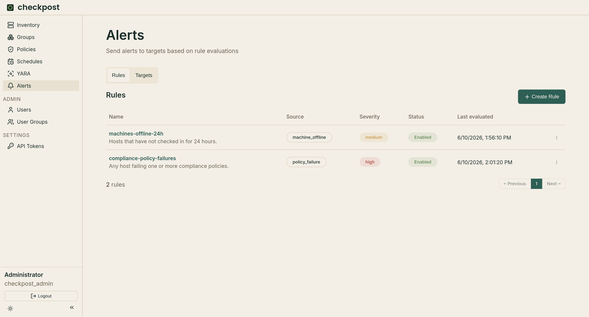

# Alerts

Set `alerts.enabled = true` in `config.toml` to run the alert engine.

{ loading=lazy }

## Rules and targets

The **Rules** tab defines what to watch. Checkpost currently supports two sources:

- **Policy failure** — machines that are failing a policy. Rules can filter by policy, machine group, and severity.
- **Machine offline** — machines that have not reported within a threshold (default 24h).

The **Targets** tab configures webhook or SMTP delivery. SMTP uses the global relay under `[alerts.smtp]`. A target's recipients may be literal addresses, `user-group:<name>`, or `owner`, which resolves to the affected machine owner's email.

## How evaluation works

The engine wakes on a short internal tick and evaluates each rule that is due according to its **evaluation interval**. On every evaluation it re-runs the rule's source query. The current set of matches is then reconciled against the rule's persisted state:

- A match that is newly seen becomes **pending** (or fires immediately when `for` is `0`).
- A match already pending is promoted to **firing** once enough time has elapsed.
- A match that was firing keeps firing, and re-notifies on the **repeat interval**.
- A match that has disappeared from the query is **resolved**, and its state is discarded.

Rules send both firing and resolved notifications. The repeat interval controls how often a still-firing alert re-notifies.

## The `for` duration

The `for` value delays notification until a condition has held continuously for that long. It exists to suppress transient failures, a policy that fails once and immediately recovers should not page anyone.

When a match first appears, Checkpost records the time it was first seen and marks the alert **pending**. On each later evaluation it checks whether `now - first_seen` has reached the `for` duration. Once it has, the alert transitions to **firing** and notifies. A `for` of `0` fires on the first evaluation with no pending period.

!!! note
    If the match disappears from the query for even a single evaluation, its pending state is deleted and the `for` timer resets to zero. When the condition reappears it starts a fresh pending period.

## Interaction with stale policy data

This reset behaviour matters most for policy-failure rules, because a policy result is only counted while it is *fresh*.

A policy result is considered stale once its last check is older than `app.policy_stale_after`. The alert engine excludes stale results from policy-failure evaluation entirely.

The consequence: a policy-failure alert with a `for` duration only fires if the machine reports the policy as *failing and fresh* on every evaluation across the whole `for` window. If a machine goes silent long enough for its result to pass `app.policy_stale_after`, the match drops out, the pending state is deleted, and the `for` countdown restarts from zero when the machine next reports the failure.

!!! note
    Keep `for` comfortably larger than `app.policy_stale_after`, and keep `app.policy_stale_after` larger than how often machines actually report. With, for example, `policy_stale_after = 72h` and `for = 7d`, the alert tolerates reporting gaps of up to three days without resetting the week-long timer. If `for` were shorter than the reporting cadence, or `policy_stale_after` shorter than it, the timer could reset before it ever completed and the alert would never fire.
