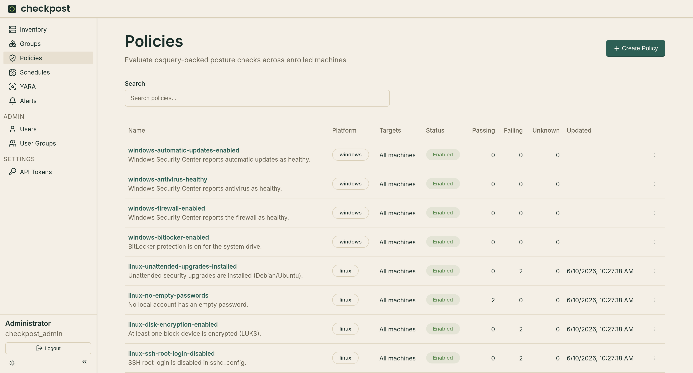
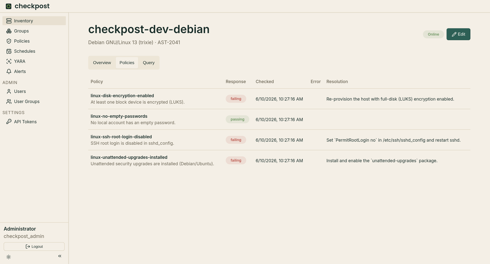
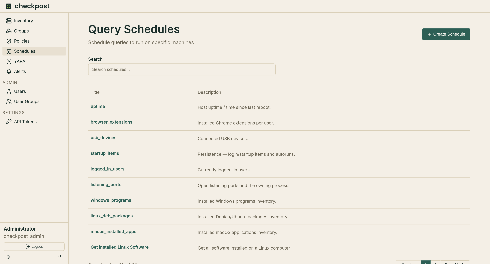
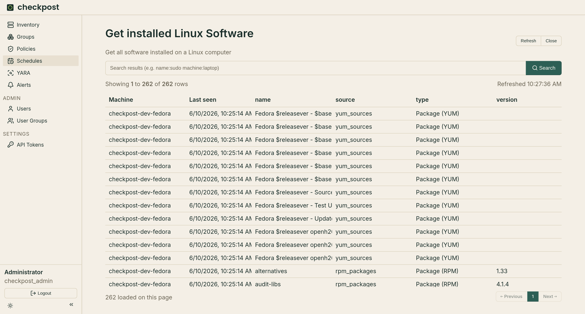
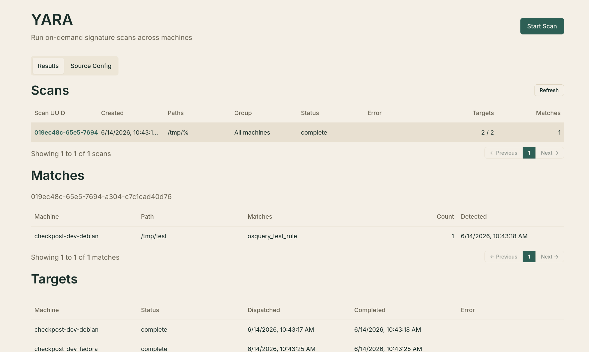

# Detections

Policies, schedules, YARA, and alerts are the main detection workflows in Checkpost.

## Policies

A policy runs an osquery query and records whether each targeted machine passes.

The first result row must contain a value of `1` to pass. A value of `0`, or no rows, fails. Other result shapes are recorded as malformed.

Policies can target a platform and one or more machine groups. An empty group selection applies the policy to all matching machines.

{ loading=lazy }

Include a practical resolution with each policy. Checkpost displays it with failed results and includes it in policy-failure alerts.

Select the machine count on the policy list to inspect passing, failing, and unknown machines. Results become stale after `app.policy_stale_after`, which usually means the host has not reported recently enough.

{ loading=lazy }

## Schedules

A schedule runs an osquery query at a fixed interval. It can target a platform, machine groups, a percentage shard, and an osquery version constraint.

{ loading=lazy }

Snapshot mode returns the complete result set on every run. Differential mode reports additions and, when enabled, removals.

Select a schedule to browse collected rows. Search and pagination run against the backend selected by `results.reader`.

{ loading=lazy }

## YARA

The **Scans** tab starts file scans and shows their targets and matches. Provide one or more paths and rule URLs, then optionally limit the scan to a machine group.

{ loading=lazy }

**Sources Config** is used to configure osquery `signature_urls`. This is an array of URLs (could be point to a single file or multiple paths using regex), that is used by osquery to constraint what rules are allowed while scanning.

Checkpost sends YARA work through osquery and records the returned matches. It does not quarantine or delete files.

Refer to [osquery YARA docs](https://osquery.readthedocs.io/en/stable/deployment/yara/) for further reference.

Alerts on policy failures and offline machines are covered on the [Alerts](alerts.md) page.

## Result storage

Checkpost can write scheduled query rows to several backends at once:

- Parquet and DuckDB are enabled by default and fit a single small installation. Set `duckdb_path` to persist the catalog.
- ClickHouse provides external storage for larger or multi-instance deployments. `ttl_days` sets a global retention period.
- NDJSON writes to a file or standard output for an external collector. It cannot serve reads.

`results.reader` accepts `parquet`, `clickhouse`, or an empty value. Empty prefers Parquet, then ClickHouse. A backend's `required` option makes ingest fail with HTTP 503 when that backend cannot accept a result.
