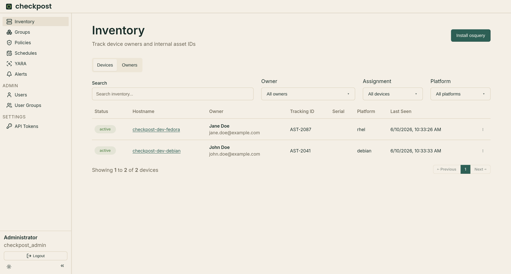
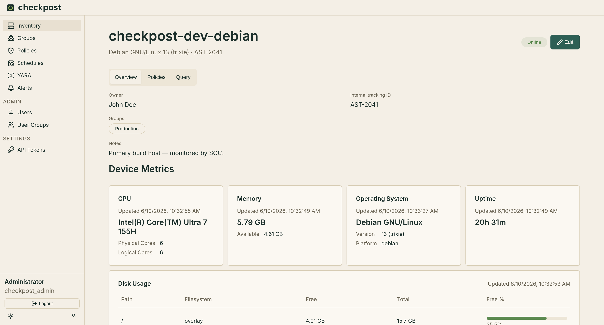
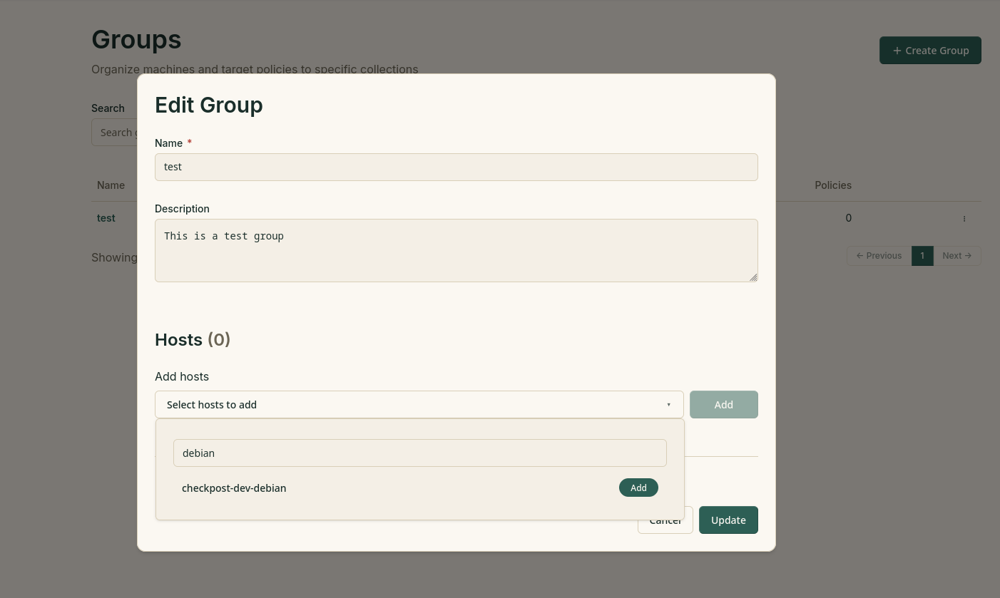

# Inventory

Inventory lists enrolled machines and their last-seen state. Search by hostname, filter by platform or owner, or show only assigned or unassigned machines.

{ loading=lazy }

The **Owners** tab keeps contact and organizational details separate from machine records. Assign an owner, internal tracking ID, and notes from the machine inventory editor.

Use **Install osquery** to open the enrollment instructions generated from the server configuration. See [setup](../setup.md#enroll-hosts) for the required HTTPS and package settings.

## Machine details

Select a machine to open its detail page:

{ loading=lazy }

- **Overview** shows operating system and hardware metrics. Users with update access can change the owner, groups, tracking ID, and notes.
- **Policies** shows the machine's current policy posture.
- **Query** runs live osquery SQL and keeps a query history.

Live queries depend on the host being online. Checkpost does not limit query cost beyond what osquery accepts, so test expensive queries on a small group first.

## Machine Groups

Machines can be assigned groups which can be used to target scheduled queries and policies.

{ loading=lazy }

Create a group with a name and description, then assign machines from the group editor or the machine details page. Deleting a group removes the grouping record; it does not delete its machines.
